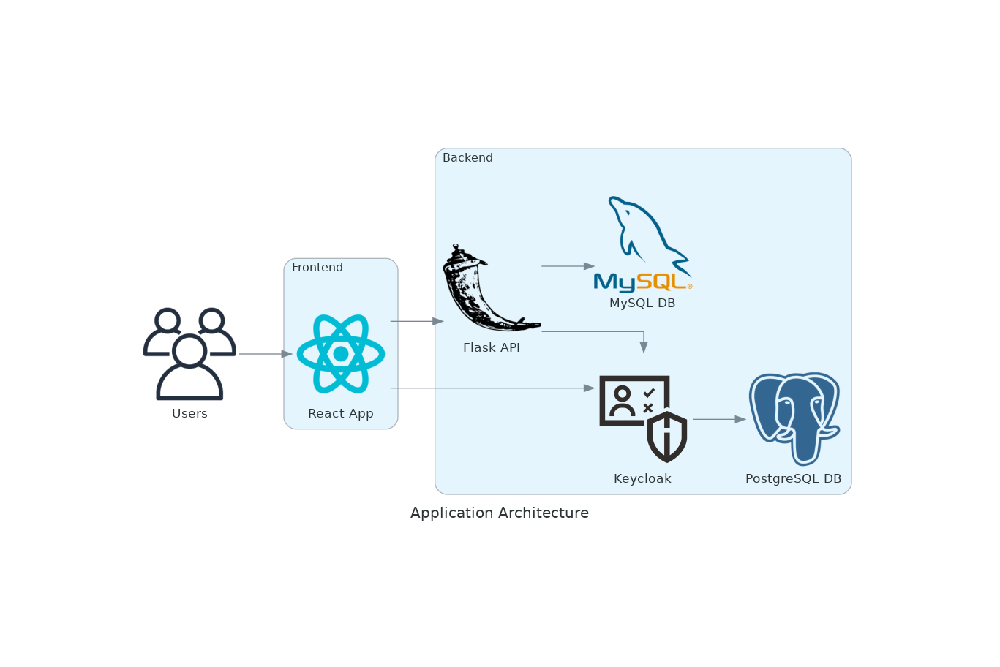
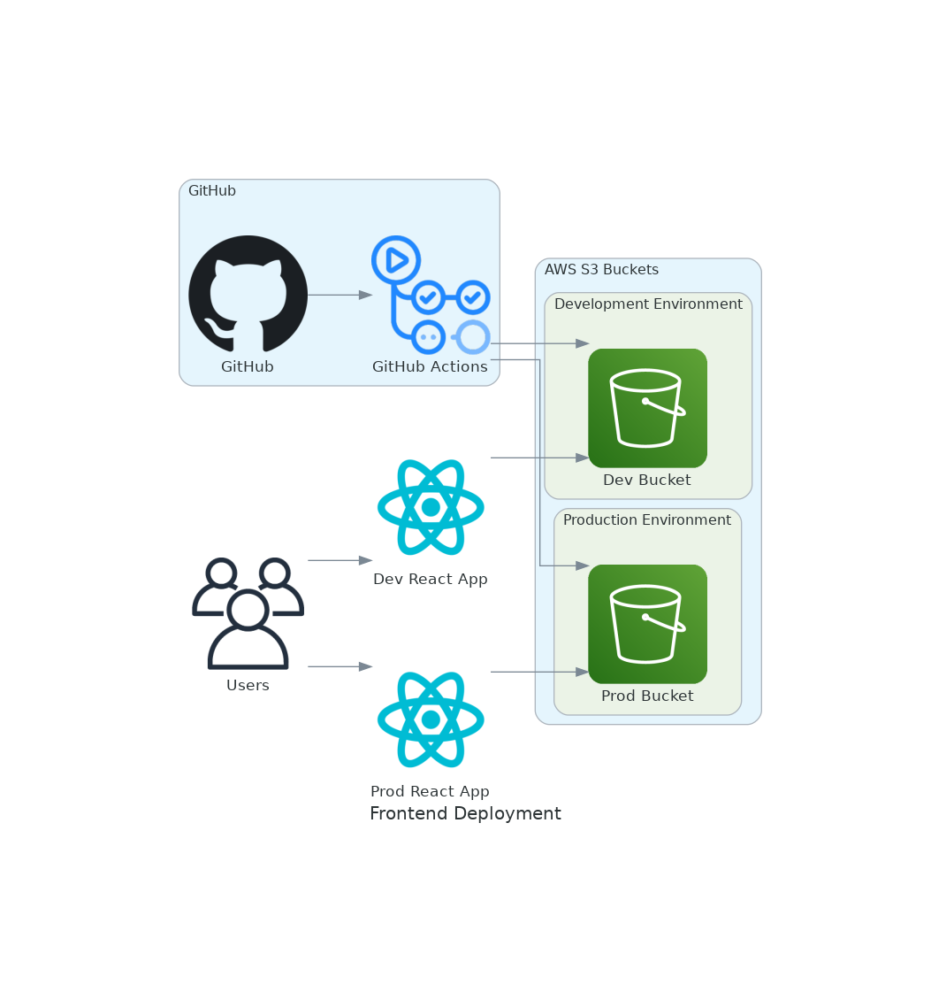
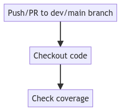
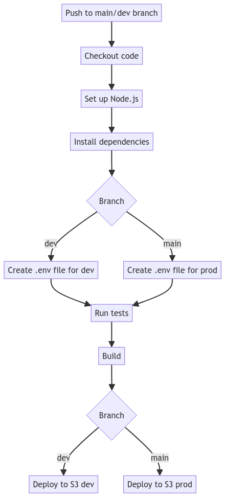

# Frontend Deployment Documentation

## Overview

This document provides a detailed explanation of the frontend deployment process, including

* the Continuous Deployment (CD) and Continuous Integration (CI) pipelines
* Environment configurations and secrets management
* Deployed environments and S3 buckets
   - Amazon S3 is a highly scalable, secure, and cost-effective storage service that can be used to host static websites and assets. (great for a small application) 
   - However, it has limitations in terms of latency, security, and handling high traffic. These drawbacks can be effectively mitigated by integrating Amazon **_CloudFront_** (a content delivery network (CDN)).

### Application Architecture

### Frontend Deployment Overview

---
## Technologies Used

* **GitHub Actions**: For CI/CD automation.
* **Amazon Web Services (AWS)**: For hosting the application on S3.
* **Node.js**: For Building/Testing the frontend application.

---
## CI Pipeline Workflow

### Trigger

The CI pipeline is triggered by:

* Push events to the `dev` or `main` branches.
* Pull requests targeting the `main` or `dev` branches.

### Jobs and Steps

The CI pipeline consists of a single job that performs the following steps:

#### Coverage Job

* **Runs-on**: `ubuntu-latest`
* **Permissions**: Grants write permissions to checks, pull-requests, and contents.

#### Steps

1. **Checkout code**
2. **Check coverage**
    * Uses `ArtiomTr/jest-coverage-report-action@v2` to run tests and generate a coverage report.

---
## CD Pipeline Workflow

### Trigger

The CD pipeline is triggered by a push event to the `main` or `dev` branches.

### Jobs and Steps

The pipeline consists of several jobs and steps executed sequentially:

#### Build Job

* **Runs-on**: `ubuntu-latest`

#### Steps

1. **Checkout code**
    * check out the repository code.
2. **Set up Node.js**
    * set up Node.js version 18.
3. **Install dependencies**
    * Runs `npm install` to install project dependencies in the `./app` directory.
4. **Create .env file for dev**
    * If the branch is `dev`, creates a `.env` file with environment-specific variables for development.
5. **Create .env file for prod**
    * If the branch is `main`, creates a `.env` file with environment-specific variables for production.
6. **Run tests**
    * Runs `npm test` to execute tests in the `./app` directory.
7. **Build**
    * Runs `npm run build` to build the project in the `./app` directory.
8. **Deploy to S3 (prod)**
    * If the branch is `main`, deploys the build to an S3 bucket for production.
    * Uses `aws s3 sync` command to sync the build directory with the S3 bucket.
9. **Deploy to S3 (dev)**
    * If the branch is `dev`, deploys the build to an S3 bucket for development.
    * Uses `aws s3 sync` command to sync the build directory with the S3 bucket.

---
## Supporting Multiple Environments

The deployment process is designed to support two environments: development (`dev`) and production (`prod`).
This is achieved through the use of environment-specific .env files and S3 buckets.

1. **Environment-specific .env files**:
    * The CD pipeline creates a `.env` file with environment-specific variables for `dev` and `prod` branches.

2. **Separate S3 Buckets**:

    * Deploys the build to different S3 buckets based on the branch:
        * `dev` branch: S3 bucket for development (`s3://ds2-bucket-dev`)
        * `main` branch: S3 bucket for production (`s3://ds2-bucket`)

---
## Environment Configuration

We store sensitive information in the GitHub secrets and then create environment-specific .env files in the CD pipeline.
These secrets are then used in the frontend application configuration.

#### The secrets used in Deployment:

* **REACT\_APP\_KEYCLOAK\_URL\_DEV**: Keycloak URL for development environment.
* **REACT\_APP\_KEYCLOAK\_REALM\_DEV**: Keycloak realm for development environment.
* **REACT\_APP\_KEYCLOAK\_CLIENT\_ID\_DEV**: Keycloak client ID for development environment.
* **REACT\_APP\_API\_URL\_DEV**: API URL for development environment.
* **REACT\_APP\_KEYCLOAK\_URL\_PROD**: Keycloak URL for production environment.
* **REACT\_APP\_KEYCLOAK\_REALM\_PROD**: Keycloak realm for production environment.
* **REACT\_APP\_KEYCLOAK\_CLIENT\_ID\_PROD**: Keycloak client ID for production environment.
* **REACT\_APP\_API\_URL\_PROD**: API URL for production environment.
* **AWS\_ACCESS\_KEY\_ID**: AWS access key ID for deploying to S3.
* **AWS\_SECRET\_ACCESS\_KEY**: AWS secret access key for deploying to S3.
* **AWS\_REGION**: AWS region for the S3 bucket.
* **GITHUB\_TOKEN**: GitHub token for posting coverage comments **_(automatically generated by GitHub Actions)_**.

- - -

## Diagrams

### CI Pipeline Workflow Diagram

### CD Pipeline Workflow Diagram

---
## Conclusion

1. **Automated CI/CD Pipelines**: The CI/CD pipelines automate the process of building, testing, and deploying the
   frontend application, ensuring consistency and efficiency.
2. **Secure Configuration Management**: Sensitive data is securely managed using GitHub secrets, maintaining the
   integrity and confidentiality of environment-specific configurations.
3. **Scalable and Reliable Deployment**: The use of AWS S3 ensures application scalability and reliability, facilitating
   streamlined and repeatable deployment processes.
